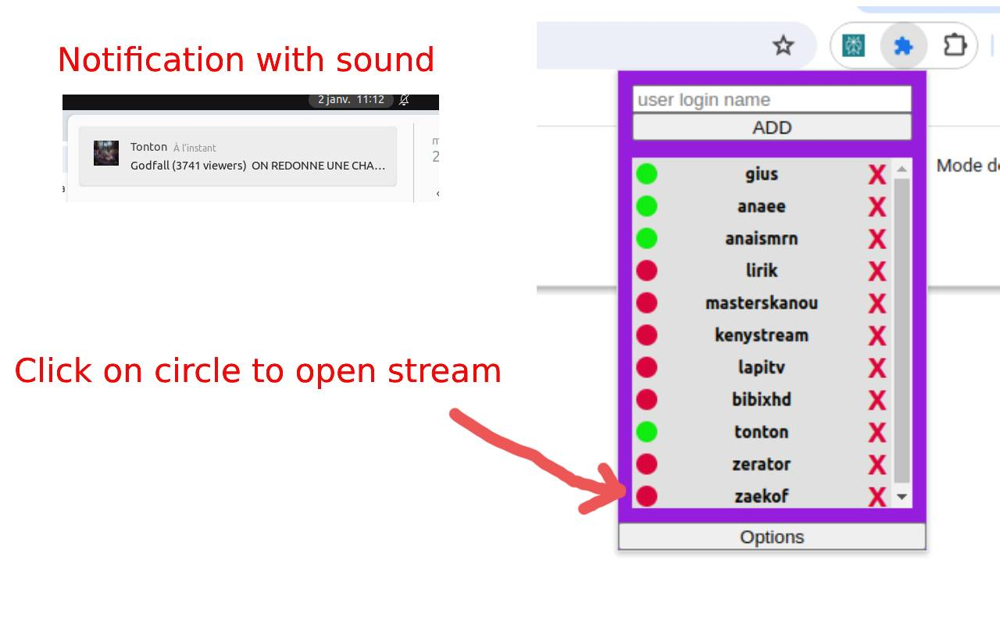
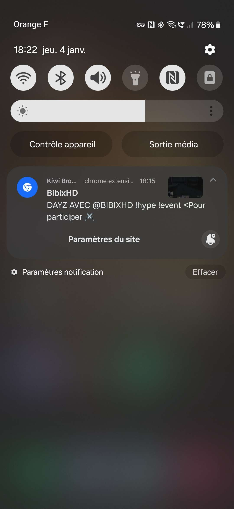
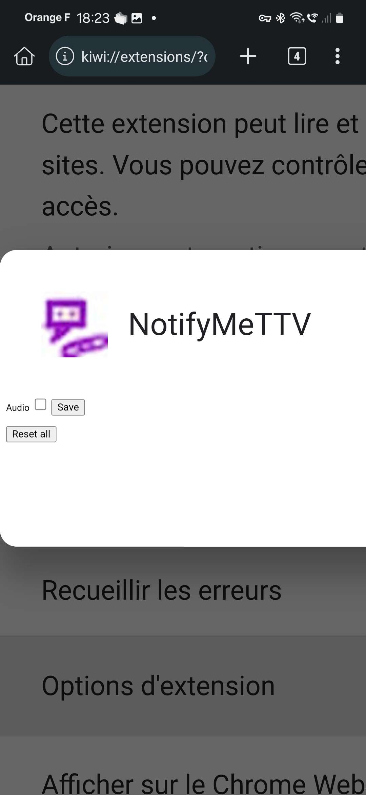

# NotifyMeTTV

Get notified when someone in your list has started livestream on Twitch



- With [Kiwi Browser](https://play.google.com/store/apps/details?id=com.kiwibrowser.browser&hl=fr&gl=US) (based on
  chromium), you can download this extension and get notifications.
  

- You can mute the audio notification in the settings.
  

## Setup env

- Create new file: `src/dev-consts.js`

```js
export const DEV_TWITCH_CLIENT_ID = '{YOUR_TWITCH_CLIENT_ID_HERE}' // https://dev.twitch.tv/console/apps
export const DEV_TWITCH_REDIRECT_URL = 'https://{YOUR_EXTENSION_ID_HERE}.chromiumapp.org/' 
```


